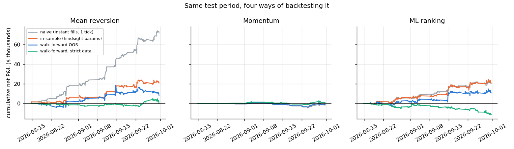

# Brent Futures Spread Backtester

Backtesting calendar spread and butterfly strategies on hourly Brent crude futures, with walk-forward validation and trading costs. Built with Python (pandas, scikit-learn), FastAPI and React.

**Short version:** the first backtest said mean reversion made **$72k** in seven weeks. After fixing execution timing, stale prices and parameter selection, it made $8k. That profit came only from illiquid back months, and it disappears at 2× trading costs. Momentum and an ML ranking model failed as well. The project ended up being more about *why backtests lie* than about finding a strategy.

**Live app:** `https://<your-app>.vercel.app` · **API docs:** `https://<your-api>.onrender.com/docs`



## What it does

1. **Data.** Downloads hourly bars for 11 consecutive NYMEX Brent Last Day Financial futures (BZ, Nov-26 to Sep-27) from Yahoo Finance. BZ cash-settles against ICE Brent. Two months of data: 22 Jul to 30 Sep 2026, 1,125 hours.
2. **Instruments.** Builds calendar spreads (front − back) and butterflies (front − 2 × middle + back). Back months trade rarely, so a spread only gets a price when every leg traded within the last 2 hours. 7 of 19 possible spreads had enough data.
3. **Strategies.**
   - **Mean reversion:** rolling z-score, fade big moves.
   - **Momentum:** trade in the direction of the recent, volatility-scaled move.
   - **ML ranking:** random forest predicts each spread's next 6-hour move, then goes long the best prediction and short the worst.
4. **Walk-forward testing.** Train on everything up to week *n*, test on week *n + 1*, repeat (7 folds). Parameters and models only ever see past data. The ML training set is purged so its targets don't overlap the test week.
5. **Costs.** $2.50 fees plus 1–3 ticks of slippage per contract per side (more for illiquid months). Fills happen at the spread's next fresh price, not at the price that created the signal.
6. **Robustness checks.** Rerun everything with strict data (every leg must trade in the same hour), scale costs from 0.5× to 3×, and break P&L down by instrument.

## Results

Net P&L over the test period (14 Aug – 30 Sep 2026), one spread unit = 1,000 bbl per leg:

| Strategy | Naive | In-sample | **Walk-forward** | Strict data | 2× costs |
|---|---:|---:|---:|---:|---:|
| Mean reversion | +$72,030 | +$20,940 | **+$8,385** | +$385 | −$13,610 |
| Momentum | −$1,550 | −$965 | **−$965** | +$1,115 | −$3,360 |
| ML ranking | +$20,905 | +$20,605 | **+$10,765** | −$11,095 | −$4,430 |

- **Naive:** hindsight-best parameters, filled instantly at the signal price, 1-tick costs.
- **In-sample:** hindsight-best parameters with realistic fills and costs.
- **Walk-forward:** parameters chosen only from past data. This is the honest number.

## What I learned

- **Execution timing was most of the "edge".** Filling at the same price that generated the signal made mean reversion look incredible. Waiting for the next real price cut the profit by more than half.
- **Stale prices invent moves.** If one leg last traded 3 hours ago, the spread "moves" whenever the other leg does. Most of the remaining profit came from exactly those thinly traded spreads (F27-G27, G27-H27 and the F/G/H fly). The liquid spreads (Nov/Dec, Dec/Jan and the Nov/Dec/Jan fly) lost money.
- **Hindsight parameter choice is overfitting.** 15 of 18 mean-reversion settings were profitable over the test period, which *looks* robust. Picking settings honestly, week by week, gave less than half of the best one.
- **ML didn't find anything new.** The random forest's top features were volatility and z-score, so it relearned mean reversion, including the same noise. Its prediction correlation swung between 0.07 and 0.50 from week to week.
- **Validation matters more than the model.** Every extra check (delay, strict data, higher costs) removed profit. None of them added any.

## Screens

| Page | What's there |
|---|---|
| Overview | Headline result table and findings |
| Market data | Forward curve snapshots, liquidity per contract, spread prices |
| Walk-forward results | Equity curves for the four backtest versions, per-instrument P&L, parameter grid, cost sensitivity, fold choices |
| Strategy lab | Pick parameters, costs, execution delay and data strictness, and rerun the backtest live on the API |
| Methodology | Assumptions, limitations, references |

## Project structure

```
backend/
  backtester/        core library
    data.py          download hourly bars from Yahoo Finance
    spreads.py       build calendar spreads + butterflies, staleness filter
    strategies.py    mean reversion, momentum, random-forest ranking
    engine.py        P&L with execution delay and costs, metrics
    study.py         walk-forward study + robustness checks -> results/
    charts.py        PNG charts for this README
  app/               FastAPI server (serves results, runs the strategy lab)
  data/              saved hourly data snapshot (CSV)
  results/           output of the study (JSON/CSV)
  tests/             pytest: engine + API
frontend/            React + TypeScript (Vite, Recharts)
render.yaml          Render blueprint for the API
.github/workflows/   CI: backend tests, frontend lint + build
```

## Run locally

```bash
# backend (Python 3.11)
cd backend
pip install -r requirements-dev.txt
python -m pytest                   # 14 tests
python -m backtester.study         # optional: rerun the study (~30s)
uvicorn app.main:app --reload      # http://localhost:8000/docs

# frontend (Node 20+), in another terminal
cd frontend
npm install
npm run dev                        # http://localhost:5173 (proxies /api to :8000)
```

To use fresh data, run `python -m backtester.data` and then `python -m backtester.study`. Yahoo only keeps about 60 days of hourly history, so the numbers will differ from the ones above.

## API

| Method | Endpoint | Returns |
|---|---|---|
| GET | `/api/health` | status and data end date |
| GET | `/api/market` | contracts, last prices, liquidity, weekly curve snapshots |
| GET | `/api/spreads?max_stale=2` | hourly spread prices and tradable hours |
| GET | `/api/study` | full walk-forward study results |
| GET | `/api/study/equity/{strategy}` | equity curves (`mean_reversion`, `momentum`, `ml_ranking`) |
| POST | `/api/lab/run` | run a rule strategy with custom settings |

## Deployment

- **API on Render:** New → Blueprint → select this repo. It reads `render.yaml`. After the frontend is live, set `ALLOWED_ORIGINS` to the Vercel URL.
- **Frontend on Vercel:** New Project → import this repo → Root Directory `frontend` (Vite is auto-detected). Add the environment variable `VITE_API_URL=https://<your-api>.onrender.com`.

The free Render plan sleeps when idle, so the first request after a while takes up to a minute.

## Limitations

- Seven weeks of test data is short, and one market regime (steep backwardation).
- Hourly last-trade prices are not bid/ask quotes, so real execution costs for back months are unknown.
- The Nov-26 contract expired on the last day of the sample.

## References

- Bailey, Borwein, López de Prado & Zhu (2014), [The Probability of Backtest Overfitting](https://papers.ssrn.com/sol3/papers.cfm?abstract_id=2326253)
- López de Prado (2018), *Advances in Financial Machine Learning*, ch. 7 and 11
- [CME Brent Crude Oil Last Day Financial futures contract specs](https://www.cmegroup.com/markets/energy/crude-oil/brent-crude-oil.contractSpecs.html)
- [ICE Brent Crude futures](https://www.ice.com/products/219/Brent-Crude-Futures)

Data from Yahoo Finance via [yfinance](https://github.com/ranaroussi/yfinance). Not investment advice.
